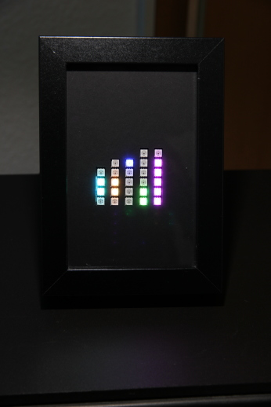
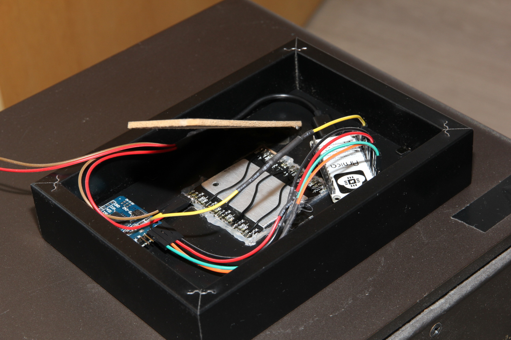

# neopixel-binary-clock
Binary clock using Neopixels, ESP8266 and DS3231 real time clock.



## Libraries used
* [esp8266](https://github.com/esp8266/Arduino)
* [NeoPixelBus by Makuna](https://github.com/Makuna/NeoPixelBus)
* [Rtc by Makuna](https://github.com/Makuna/Rtc)

## Code used
* [NTPClient example from esp8266](https://github.com/esp8266/Arduino/blob/master/libraries/ESP8266WiFi/examples/NTPClient/NTPClient.ino)

## Timezones
The program is configured to display CET, but this can be changed in ```timezone.h```. Daylight
saving time is also implemented.

## Wiring
Please check before connecting your hardware, this information might be wrong on some breakouts.

### NeoPixel
NeoPixel data is RX-pin on NodeMCU.
I used 5 1x8 NeoPixel strips. Month, day, hour, minute and second have their own strip, so some
NeoPixels are unused. The program uses the following offsets to address the pixels:

* Second: 0
* Minute: 8
* Hour: 16
* Day 24
* Month: 32

### DS3231
* SDA -> GPIO04 (D2)
* SCL -> GPIO05 (D1)

